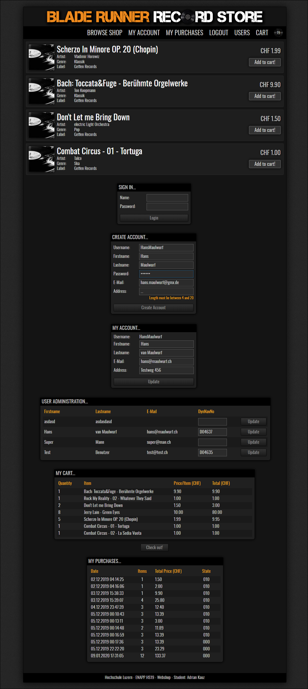

# HSLU FS19 ENAPP (Enterprise Applications)- Webshop Exercise
This is my version of the webshop to fulfill the given task. It's not perfect but it works :-)

## Getting started
* Just open the project with _IntelliJ IDEA_
* Prepare DB with [this](project/configs/webshop_db.sql) script
* Install [tomee.xml](project/configs/tomee.xml)
* Login data and passwords were removed. You will find the current user/pass-combo on the [Enterpriselab-Wiki](https://wiki.enterpriselab.ch/el/)

## How it looks

